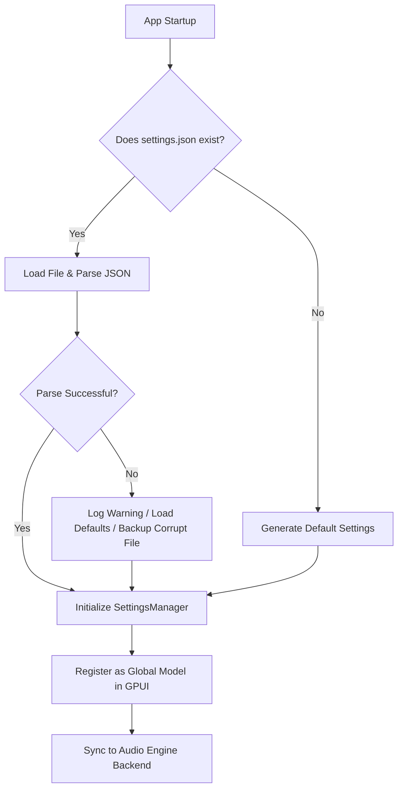

# Configuration & Settings Architecture Spec

This document describes the state management, storage lifecycle, and live syncing strategy for Futureboard's Settings subsystem.

## 1. Storage & Lifecycle (settings.json)

Settings are serialized to a single `settings.json` file.

### Directory Resolution
- **Windows**: `%APPDATA%\Futureboard\settings.json`
- **macOS**: `~/Library/Application Support/Futureboard/settings.json`
- **Linux**: `~/.config/futureboard/settings.json`

### Lifecycle Flowchart



---

## 2. GPUI State Management Model

Settings should live as a shared GPUI Model:

```rust
pub struct SettingsModel {
    pub current: SettingsSchema,
    pub path: PathBuf,
}

impl SettingsModel {
    pub fn load_or_create(cx: &mut AppContext) -> Model<Self> {
        // Load settings.json or fallback to defaults
    }

    pub fn update_setting<F>(&mut self, updater: F, cx: &mut ModelContext<Self>)
    where
        F: FnOnce(&mut SettingsSchema)
    {
        updater(&mut self.current);
        self.save_to_disk();
        cx.notify(); // Triggers UI redraw automatically across all subscribers
    }
}
```

Components subscribe to changes:

```rust
cx.subscribe(&settings_model, |this, model, event, cx| {
    // Redraw component when settings change
}).detach();
```

---

## 3. Realtime Audio Engine Syncing

Settings must be dispatched to the audio engine threads without blocking the main rendering loop.

```text
┌─────────────────┐             ┌─────────────────────┐             ┌─────────────────┐
│   GPUI Main     │             │    Audio Service    │             │   Realtime DSP  │
│  (Thread Safe)  │             │   (Message Queue)   │             │   (Audio Thread)│
└────────┬────────┘             └──────────┬──────────┘             └────────┬────────┘
         │                                 │                                 │
         │ update_setting()                │                                 │
         ├────────────────────────────────>│                                 │
         │                                 │ Apply buffer / driver changes   │
         │                                 ├────────────────────────────────>│
         │                                 │                                 │ Recalculate
         │                                 │                                 │ parameters
```

### Thread Safety Constraints
- Setting values read by the DSP thread (like buffer sizes or sample rates) must be copyable and atomic (e.g. `std::sync::atomic`), or passed via a lock-free ringbuffer (e.g. `crossbeam-channel`).
- Changing hardware parameters (like audio drivers or audio device channels) requires releasing and rebuilding the active stream inside the `SphereDirectAudioEngine`.
